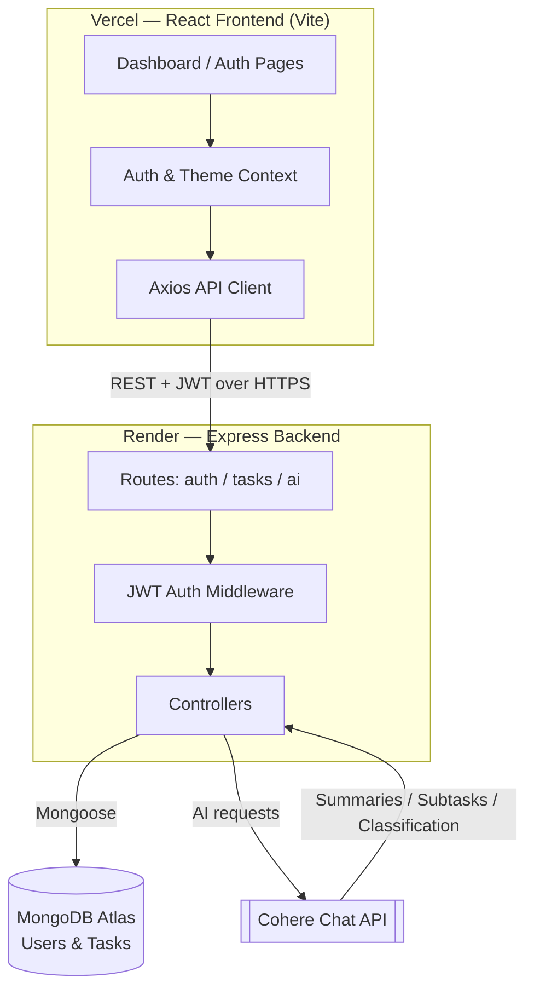

# Smart Task Management System

A full-stack task management app built with the **MERN stack** (MongoDB, Express, React, Node.js), featuring JWT authentication, task CRUD, filtering/search, priority & category organization, a stats dashboard, dark mode, and an **AI-powered productivity assistant powered by Cohere**.

🔗 **Live Demo:** [smart-task-manager-teal-two.vercel.app](https://smart-task-manager-teal-two.vercel.app/)

> **Note:** the backend is hosted on Render's free tier, which spins down after inactivity. The first request after idling can take 30–60 seconds to wake up — this is expected, not a bug.

---

## Contents

- [Features](#-features)
- [Tech Stack](#-tech-stack)
- [Architecture](#-architecture)
- [Project Structure](#-project-structure)
- [Setup Instructions](#-setup-instructions)
- [API Reference](#-api-reference-summary)
- [Windows Troubleshooting](#-windows-troubleshooting)
- [Deployment](#-deployment)

---

## ✨ Features

**Core**
- Add, view, edit, and delete tasks
- Mark tasks as Completed / Pending
- Search and filter by keyword, status, priority, and category
- Persistent storage in MongoDB via Mongoose

**AI (Cohere)**
- **AI Daily Summary** — generates a short, motivating overview of your pending workload, ordered by urgency/priority
- **AI Subtask Suggestions** — breaks any task down into 3–6 concrete, actionable subtasks
- **AI Auto-Classify** — suggests a priority level and category for a task from its title/description while creating it

**Extras**
- JWT-based user authentication (register/login)
- Task priority (Low / Medium / High) and custom categories
- Due dates with overdue highlighting
- Dashboard with live statistics (total, completed, pending, overdue, completion rate)
- Dark mode with persisted preference
- Fully responsive UI (mobile → desktop)

---

## 🧱 Tech Stack

| Layer | Technology |
|---|---|
| Frontend | React 18, Vite, React Router, Tailwind CSS, Axios |
| Backend | Node.js, Express |
| Database | MongoDB + Mongoose |
| Auth | JWT + bcrypt |
| AI | Cohere Chat API (`cohere-ai` SDK, model `command-r-plus`) |

---

## 🏗 Architecture



**Request flow example — AI Daily Summary:**

1. React dashboard calls `GET /api/ai/daily-summary` with the JWT in the `Authorization` header.
2. Express verifies the token via `middleware/auth.js`, attaches `req.userId`.
3. `aiController.getDailySummary` fetches the user's pending tasks from MongoDB.
4. The task list is sent to Cohere's Chat API with a system prompt instructing it to summarize and prioritize.
5. The generated summary is returned to the client and rendered in the AI panel.

---

## 📁 Project Structure

```
smart-task-manager/
├── backend/
│   ├── config/db.js
│   ├── models/User.js
│   ├── models/Task.js
│   ├── middleware/auth.js
│   ├── middleware/errorHandler.js
│   ├── controllers/authController.js
│   ├── controllers/taskController.js
│   ├── controllers/aiController.js
│   ├── routes/authRoutes.js
│   ├── routes/taskRoutes.js
│   ├── routes/aiRoutes.js
│   ├── utils/cohere.js
│   ├── server.js
│   └── .env.example
└── frontend/
    ├── src/
    │   ├── api/axios.js
    │   ├── context/AuthContext.jsx
    │   ├── context/ThemeContext.jsx
    │   ├── components/       # Navbar, TaskCard, TaskForm, TaskFilters,
    │   │                      # StatsPanel, AISummaryPanel, SuggestModal, ProtectedRoute
    │   ├── pages/             # Login, Register, Dashboard
    │   ├── App.jsx
    │   └── main.jsx
    └── .env.example
```

---

## ⚙️ Setup Instructions

### Prerequisites
- Node.js ≥ 18
- MongoDB running locally, or a MongoDB Atlas connection string
- A [Cohere API key](https://dashboard.cohere.com/api-keys) (free tier works)

### 1. Backend

```bash
cd backend
cp .env.example .env
# edit .env: set MONGO_URI, JWT_SECRET, COHERE_API_KEY
npm install
npm run dev        # starts on http://localhost:5000
```

### 2. Frontend

```bash
cd frontend
cp .env.example .env
# edit .env if your backend runs on a different URL
npm install
npm run dev         # starts on http://localhost:5173
```

### 3. Use the app

1. Open `http://localhost:5173`
2. Register a new account
3. Add a task and try **✨ Auto-suggest priority & category**
4. Click **✨ Suggest** on any task card for an AI subtask breakdown
5. Click **Generate** in the AI Daily Summary panel for a workload overview

---

## 🔌 API Reference (summary)

| Method | Endpoint | Description |
|---|---|---|
| POST | `/api/auth/register` | Create account |
| POST | `/api/auth/login` | Log in, returns JWT |
| GET | `/api/auth/me` | Get current user |
| GET | `/api/tasks` | List tasks (supports `search`, `status`, `priority`, `category`, `sortBy`, `order` query params) |
| POST | `/api/tasks` | Create task |
| PUT | `/api/tasks/:id` | Update task |
| DELETE | `/api/tasks/:id` | Delete task |
| PATCH | `/api/tasks/:id/toggle` | Toggle Completed/Pending |
| GET | `/api/tasks/stats` | Dashboard statistics |
| POST | `/api/ai/suggest-subtasks` | Get AI subtask breakdown for a task |
| PATCH | `/api/ai/tasks/:id/subtasks` | Persist AI subtasks onto a task |
| GET | `/api/ai/daily-summary` | AI-generated summary of pending tasks |
| POST | `/api/ai/classify` | AI-suggested priority & category |

> All `/api/tasks/*` and `/api/ai/*` routes require `Authorization: Bearer <token>`.

---

## 🪟 Windows Troubleshooting

If `npm install` or `npm run dev` fails in **PowerShell** with an error like:

```
File ...\npm.ps1 cannot be loaded because running scripts is disabled on this system.
```

This is a PowerShell script-execution policy restriction, not a project issue. Fix it one of these ways:

- **Use `npm.cmd` instead of `npm`** (no admin rights needed): `npm.cmd install`, `npm.cmd run dev`
- **Or use Command Prompt (cmd.exe)** instead of PowerShell — it isn't affected by this policy
- **Or**, if you have admin rights, run the following in an elevated PowerShell window:
  ```powershell
  Set-ExecutionPolicy -Scope CurrentUser -ExecutionPolicy RemoteSigned
  ```

If Windows prompts to allow Node.js through the firewall on first run, choosing **Private networks** is sufficient for local development. `localhost` traffic isn't affected even if you dismiss the prompt without admin rights.

---

## ☁️ Deployment

| Layer | Platform | Notes |
|---|---|---|
| Frontend | [Vercel](https://vercel.com) | Root directory `frontend`; `VITE_API_URL` set to the Render backend URL; `vercel.json` rewrite rule handles client-side routing on refresh |
| Backend | [Render](https://render.com) | Root directory `backend`; free web service; env vars set in Render dashboard |
| Database | [MongoDB Atlas](https://cloud.mongodb.com) | Free M0 cluster; Network Access set to allow all IPs (`0.0.0.0/0`) since Render doesn't provide static IPs on the free tier |

**Live app:** https://smart-task-manager-teal-two.vercel.app/